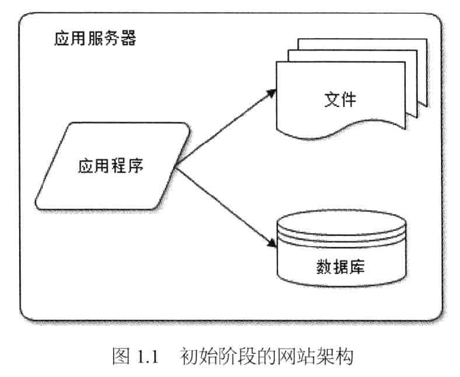
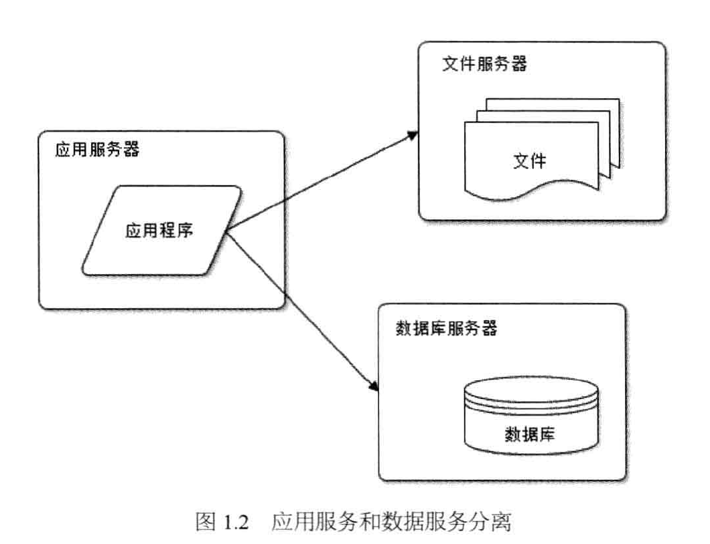
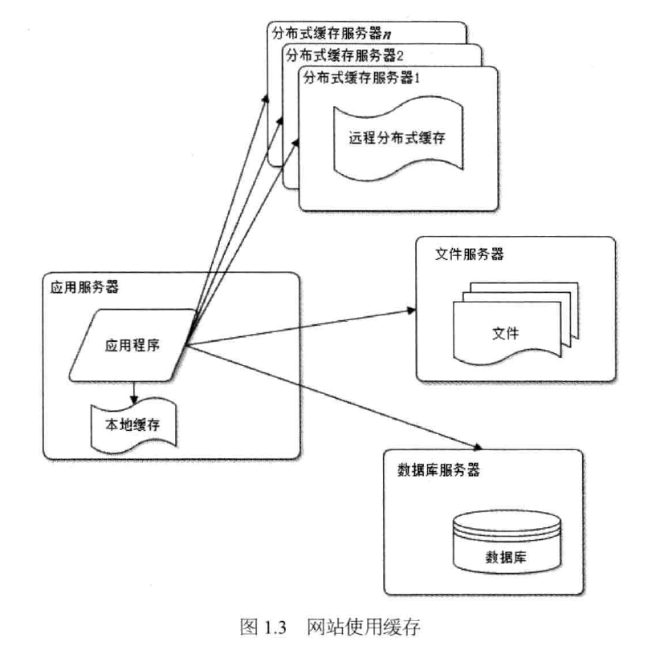
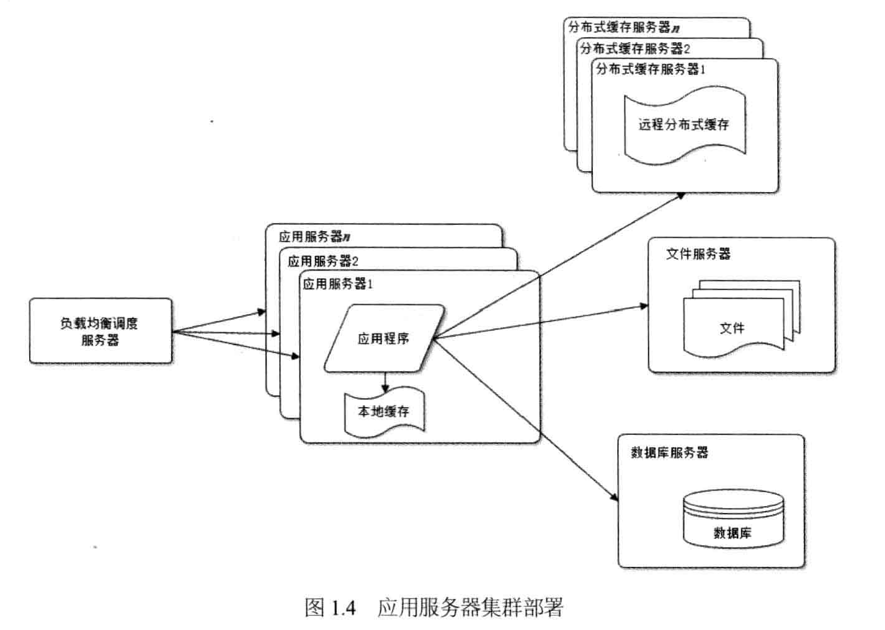
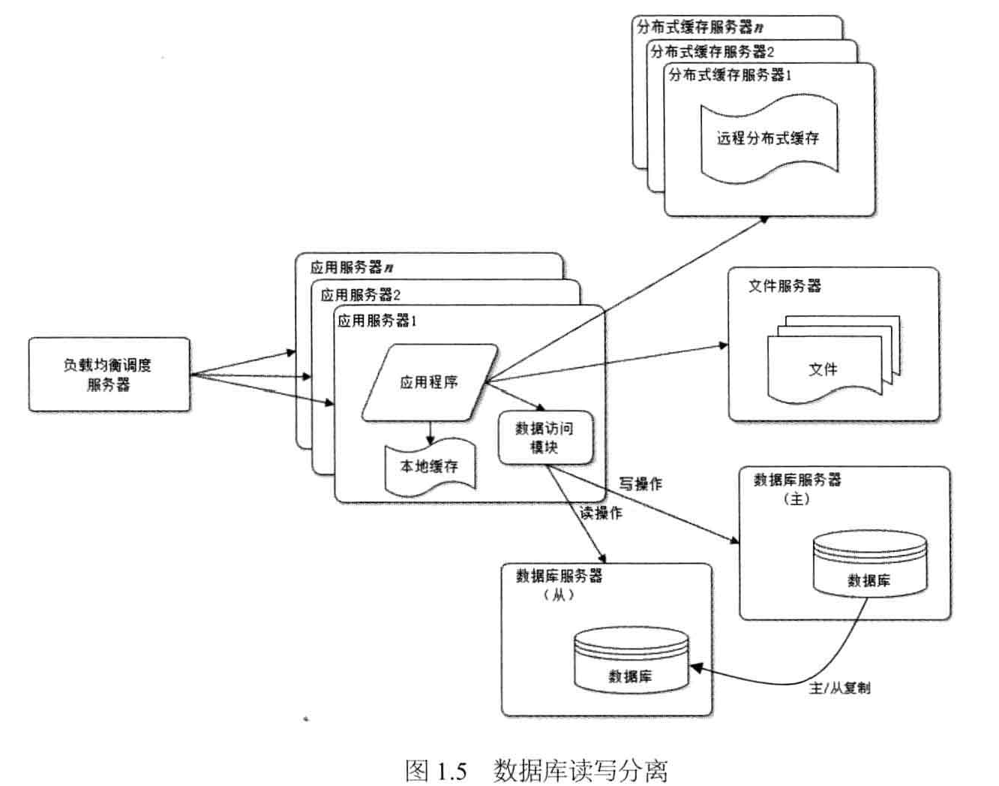
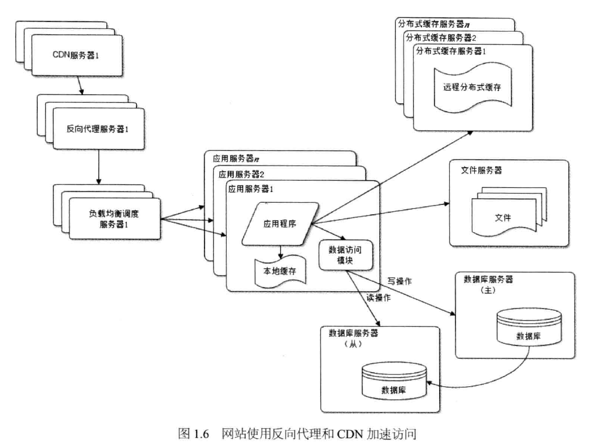
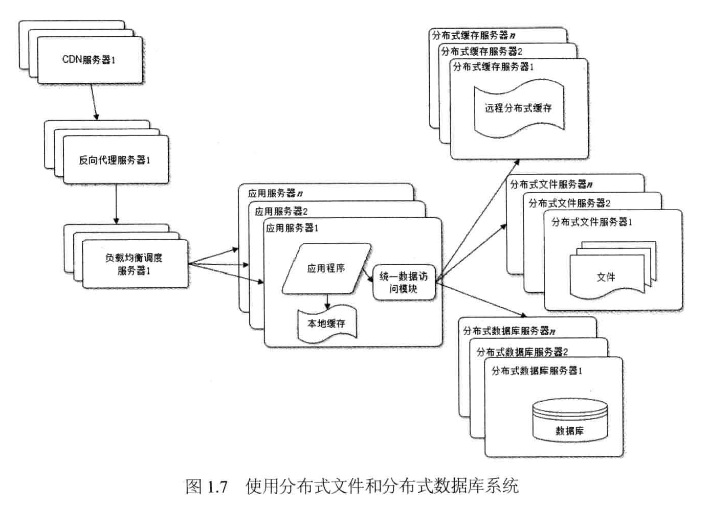
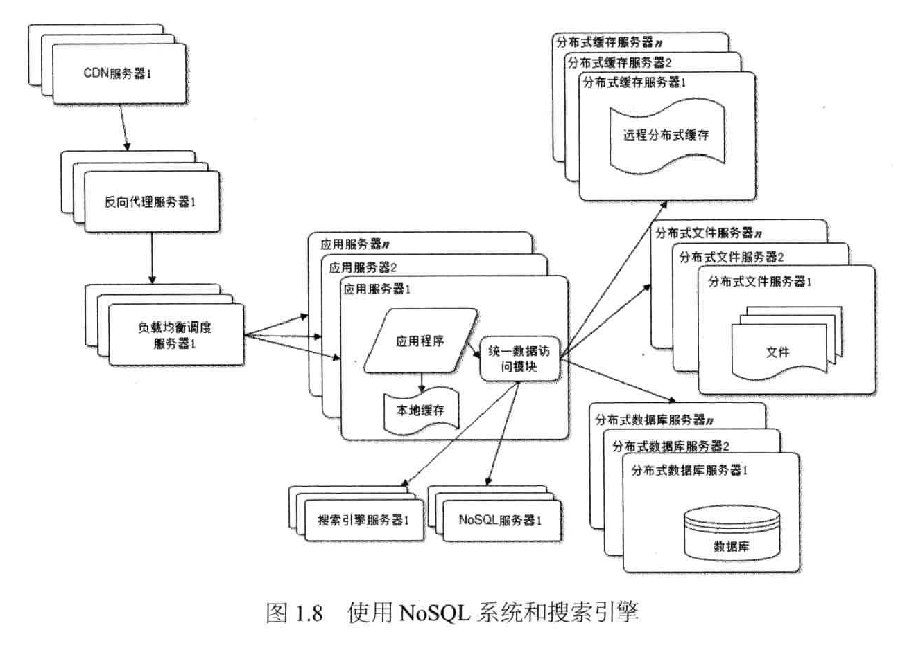
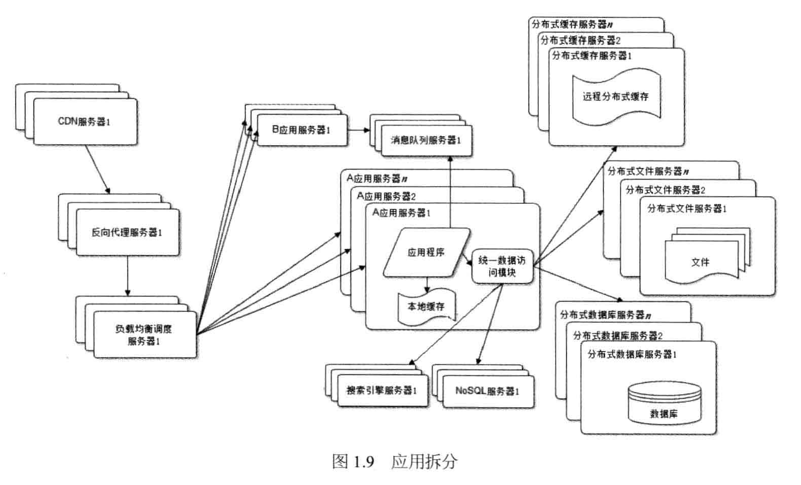
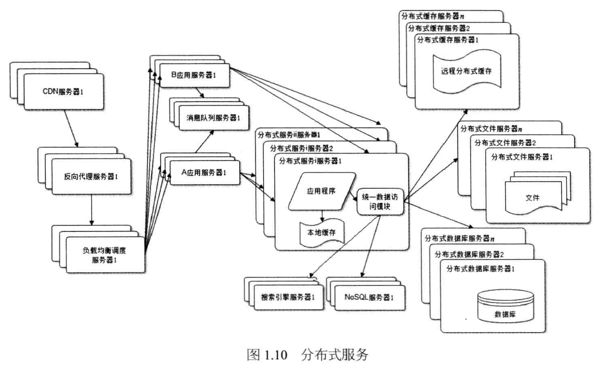

# system architecture evolution

1. 初始阶段的网站架构

   

   应用程序、数据库、文件等所有的资源都在一台服务器上。通常服务器操作系统使用Linux，应用程序使用PHP开发，然后部署到在Apache上，数据库使用MySQL，汇集各种免费开源软件及一台廉价服务器就可以开始网站的发展之路了。

   架构缺点：随着网站业务的发展，一台服务器逐渐不能满足需求，越来越多的用户访问导致性能越来越差，越来越多的数据导致存储空间不足。

2. 应用服务和数据服务分离

   

   应用和数据分离后整个网站使用三台服务器：

   - 应用服务器：需要处理大量的业务逻辑，因此需要更快更强大的CPU

   - 文件服务器：需要存储大量用户上传的文件，因此需要更大的硬盘

   - 数据库服务器：需要快速磁盘检索和数据缓存，因此需要更快的硬盘和更大的缓存

   架构缺点：随着用户逐渐增多，数据库压力太大导致访问延迟，进而影响整个网站的性能，用户体验受到影响。

3. 使用缓存改善网站性能

   

   80%的业务访问集中在20%的数据上。既然大部分的业务访问集中在一小部分数据上，那么将一小部分数据缓存在内存中，就可以减少数据库的访问压力，提高整个网站的数据访问速度，改善数据库的写入性能。

   缓存可以分为两种：

   - 本地缓存：访问速度更快一些，但是受应用服务器内存限制，其缓存数据量有限，而且会出现和应用程序争用内存的情况。

   - 远程分布式缓存：可以使用集群的方式，部署大内存的服务器作为专门的缓存服务器，可以在理论上做到不受内存容量限制的缓存服务。

   架构缺点：使用缓存后，数据访问压力得到有效缓解，但是单一应用服务器能够处理的请求连接有限，在网站访问高峰期，应用服务器成为整个网站的瓶颈。

4. 使用应用服务器集群改善网站的并发处理能力

   

   使用集群是网站解决高并发，海量数据问题的常用手段。

   对网站架构而言，只要能通过增加一台服务器的方式改善负载压力，就可以以同样的方式持续增加服务器不断改善系统性能，从而实现系统的可伸缩性。通过负载均衡调度服务器，可以将来自用户浏览器的访问请求分发到应用服务器集群中的任何一台服务器上，如果有更多的用户，就在集群中加入更多的应用服务器，使应用服务器的负载压力不再成为整个网站的瓶颈。

5. 数据库读写分离

   

   使用缓存后，绝大部分数据读操作都可以不通过数据库，但是仍会有一部分读操作（缓存访问不命中，缓存过期）和全部的写操作需要访问数据库，在网站的用户达到一定规模后，数据库因为负载压力过高而成为网站的瓶颈。

   主流数据库都提供主从热备功能，通过配置两台数据库的主从关系，可以将一台数据库服务器的数据更新同步到另一台服务器上，实现数据库读写分离，从而改善数据库负载压力。

   应用服务器写数据的时候，访问主库，主库通过复制机制将数据同步到从库，这样应用服务器读数据的时候，就通过从库获取数据。为了便于应用程序访问读写分离后的数据库，通常在应用服务器端使用专门的数据访问模块，使数据库读写分离应用透明。

6. 使用反向代理和CDN加速网站响应

   

   研究表明，网站访问延迟和用户流失率呈正相关，随着网站业务不断发展，用户规模越来越大，网站访问越慢，用户越容易失去耐心而离开。为了提供更好的用户体验，留住用户，网站需要加速网站访问速度。主要手段有使用CDN和反向代理。使用CDN和反向代理的目的都是返回数据给用户，一方面加快用户访问速度，另一方面也减轻后端服务器的负载压力。

   CDN和反向代理的基本原理都是缓存。区别在于：

   - CDN部署在网络提供商的机房，使用户在请求网站服务时，可以从距离自己最近的网络提供商机房获取数据

   - 反向代理部署在网站的中心机房，当用户请求到达中心机房后，首先访问的服务器是反向代理服务器，如果反向代理服务器缓存着用户请求的资源，就将其直接返回给用户。

7. 使用分布式文件系统和分布式数据库系统

   

   任何强大的单一服务器都满足不了大型网站持续增长的业务需求。数据库经过读写分离后，从一台服务器拆分成两台服务器，但是随着网站业务的发展依然不能满足需求，这时需要使用分布式数据库。文件系统也是一样，需要使用分布式文件系统。

   分布式数据库时网站数据库拆分的最后手段，只有在单表数据规模非常庞大的时候才使用。不到万不得已，网站更常用的数据库拆分手段是业务分库，将不同业务的数据库部署在不同的物理服务器上。

8. 使用NoSQL和搜索引擎

   

   随着网站业务越来越复杂，对数据存储和检索的需求也越来越复杂，网站需要采用一些非关系数据库如NoSQL和非数据库查询技术如搜索引擎，两者对可伸缩的分布式特性具有更好的支持。应用服务器则通过一个统一数据访问模块访问各种数据，减轻应用程序管理诸多数据源的麻烦。

9. 业务拆分

   

   大型网站业务日益复杂，通过分治的手段将整个网站业务分成不同的产品线，如电商系统中的商品、订单、买家、卖家等拆分成不同的产品线，分归不同的业务团队负责。

   具体到技术上，也会根据产品线划分，将一个网站拆分成许多不同的应用，每个应用独立部署维护。应用之间可以通过超链接建立关系，也可以通过消息队列进行数据分发，当然最多的还是通过访问一个数据存储系统来构成一个关联的完整系统。

10. 分布式服务

    

    随着业务拆分越来越小，存储系统越来越大，应用系统的整体复杂度呈现指数级增加，部署维护越来越困难。由于所有应用要和所有数据库系统连接，在数万台服务器规模的网站中，这些连接的数目是服务器规模的平方，导致数据库连接资源不足，拒绝服务。

    既然每一个应用系统都需要执行许多相同的业务操作，比如用户管理、商品管理等，那么可以将这些共用的业务提取出来，独立部署。由这些可复用的业务连接数据库，提供共用业务服务，而应用系统只需要管理用户界面，通过分布式服务调用共用业务服务完成具体业务操作。

